# Pocket Traveller

This is a Tamagotchi-inspired gadget to keep in your backpack, on your keychain, or in your pocket that encourages you to move more throughout your day.

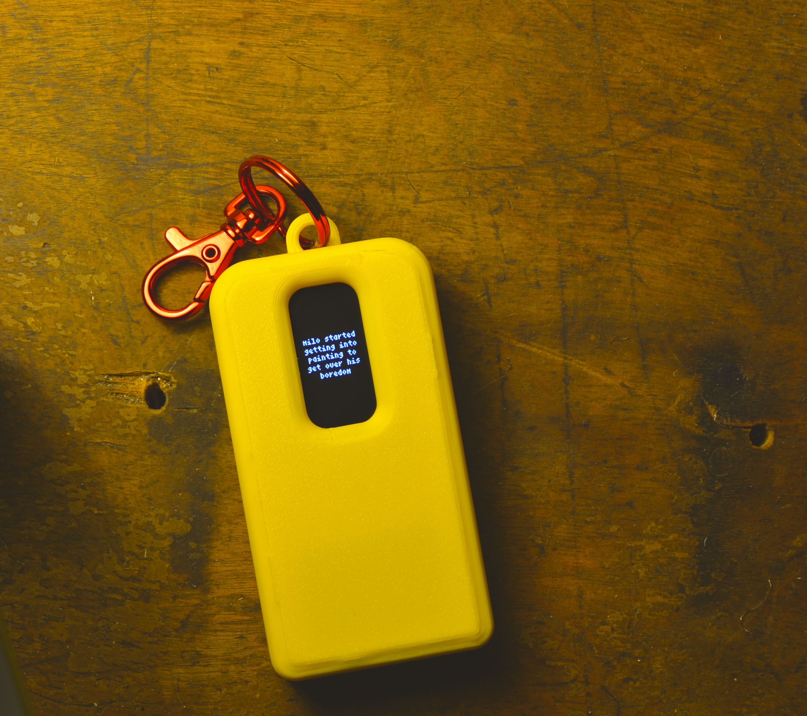

The primary feature of the device is a screen that displays an avatar named Milo. Milo will walk when you walk, rest when you're idle, and sleep during long periods of inactivity. Milo will gain **XP** the more he moves, filling up a bar at the top of the screen. When this bar fills, Milo will gain a **level**. In addition to **level**, Milo will also become a **chud**, **plebian**, or **nomad** dependent on how much he has moved in the past few days. *Skip to [Interface Design and Art](#5-interface-design-and-art) for more details*

> *The name Milo comes from the famous ancient Greek athlete, Milo of Croton. Legend has it that he would lift a newborn ox on his shoulders every day, and as the ox grew bigger, so would he. In the same way, Milo's level and state is dependent on you, as if you were the ox.*

## Hardware

* **Raspberry Pi Pico** - The brain. Reads data from the motion sensor and controls the screen.
* **SH1106** - 1.3" OLED display.
* **ADXL345** - Accelerometer. Detects instantaneous acceleration that is used to estimate longer-term motion.
* **TPU4056** - Charger module. Provides the USB-C port for charging the battery.
* **3.7v 1000mAh Lipo Battery**

All electronic components are wired together on a perfboard which is housed inside of a 3D printed case.

## Process

### 1. Breadboard Proof of Concept

#### Hardware Testing
To begin, we connected the screen and motion sensor to the Pico on a breadboard to test whether they worked properly and to figure out how to interface with them. We had some trouble finding the correct address for interfacing with our motion sensor. We got it to work eventually but ended up having to replace the sensor because it was a knockoff.

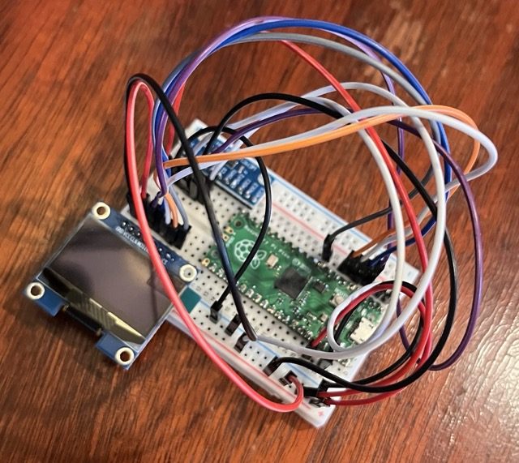

#### Motion Data Classification Experiment
The next thing we needed to test is whether we could accurately classify data from the accelerometer into two states: idle and moving. This would be the core mechanism of the device, where everything else is just essentially an just interface to wrap around it. We knew this might be difficult because we chose our motion sensors to just be an accelerometer for simplicity, not an accelerometer + GPS combo. This means that the device has no reference for changes in position, only forces acted upon the device at each moment. 

After doing some research we learned that two qualities of the data can be measured in order to detect whether the user is moving: 

**Energy:** How strongly the device is moving. Measured as population variance of the magnitude of the force acted upon the sensor in a given window. 
**Rhythm:** How rhythmic the movements in the device are. Measured as how accurately a sequence of movements lines up with a shifted copy of itself.

The importance of this rhythm quality is that some movements may involve a lot of movement, such as shaking the device around or putting it into your backpack, however these movements shouldn't be classified as "moving". Actual "moving" scenarios, such as walking or running, will have a certain rhythm to it, as steps happen at a certain relative frequency.

Given all this, we needed to come up with thresholds for these two qualities in order to distinguish between moving and idle in a given time window. First, we made a sketch for the device that would simply display "IDLE" if the wearer is idle and "MOVING" if the wearer is moving. We played around with different values for the thresholds to see if we could create a result that seemed accurate. However, none of them seemed to work. So, abandoned trial and error and made a system to calibrate these thresholds:
1. Came up with a list of all possible movement scenarios that each give different kinds of data: sitting still, standing, fidgeting, slow walking, walking, running, and driving. Sitting still, standing, fidgeting, and driving would be classified as idle, while slow walking, walking, and running would be classified as moving. The hope/hypothesis was that there should be some value for both energy and rhythm that would separate one group from the other.
2. Created a Pico sketch for collecting energy and rhythm data
3. Recorded data for each scenario by performing the actions while holding the device
4. Created a Python script that plotted out all the data on a graph and automatically recommended thresholds for both qualities

*Recording running and driving data*

https://github.com/user-attachments/assets/42bd3670-7c9c-4e70-9289-1710ddce6e91

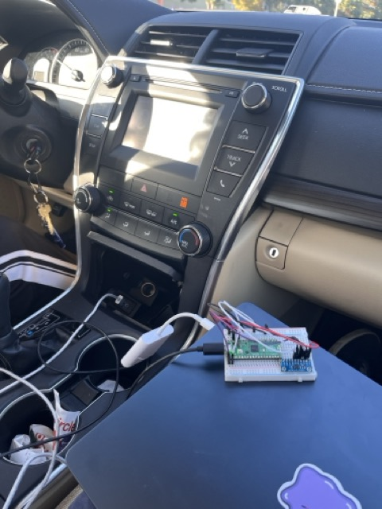

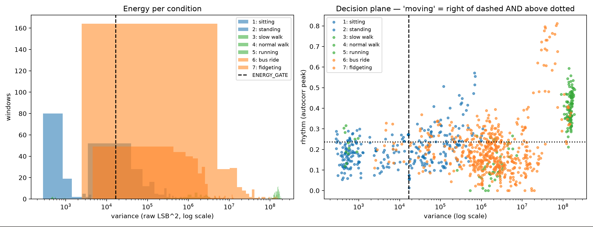

What we found was that the data reflected some of what we hoped: there is a clear distinction between the energy (variance) measured in "moving" states (shown in green) vs the energy measured in "idle" states. However, after looking at the graph on the right, we realized that rhythm was not necessary for distinguishing between moving and idle states, because the differences in energy alone already distinguished them. In addition, the recommended thresholds the script gave us were way off from what we observed in the graph. This didn't matter as much because we were able to look at the graph for ourselves and see where the line should be drawn, but it meant that something was off with our code and we would revisit it if needed.

We tried out our testing sketch again, but this time used 10^8 as our energy threshold and 0 for our rhythm threshold. This time, it was pretty reasonable at displaying "MOVING" when we moved with the device. However, since we weren't classifying the state with rhythm anymore, movements such as fidgeting shaking the device caused "MOVING" to be displayed as well. Our verdict was that this was good enough for now. As long as the device detects a moving state when the user is moving, it's ok that it doesn't perfectly detect and idle state. Random extra detected movement detected throughout the day will be insignificant compared to the actual long-term movement the user will actually do. The only downside is that the user may see the avatar on the screen move a little bit every now and then when they are just fidgeting with it. This will be something to revisit in the future when we have time to dive deeper into the calibration and data classification experiment.

#### Battery and Power States Proof of Concept

The next step was to test powering the device with a battery. There were a few new problems we needed to tackle:
Making sure the Pico doesn’t get damaged
Detecting that the device is being charged so that it can draw less power during this state and display a different screen
Adding a sleep state so that we can lengthen the battery life of the device without having an off button

After doing some research, we learned that routing the power from the battery through a schottkey diode was most optimal so that the charger module doesn’t get confused when detecting when the battery is full. We wired this up and the Pico didn’t blow up.

Next, we needed a way to detect whether the battery is currently being charged or not. Unfortunately, there was no dedicated pin for this on the TP4056 module. Our solution was to wire the input voltage signal– the voltage being received by the charging port– to a pin on the Pico. We had to use a voltage divider to transform this 5V signal into a 3.3V signal safe for the Pico. When this pin is read as high, we programmed the device to both draw less power (drawing power while charging the battery would confuse the charger module) and display “charging” text on the screen.

Finally, we programmed the device to go into “deep sleep” after a certain duration of inactivity. Because we chose to not have a power button on the device for simplicity, we needed a way for the device to turn off so that the battery doesn’t drain 24/7. This deep sleep state essentially powers off the Pico almost entirely. In order to wake the device up again, a special pin on the motion sensor that turns on when it detects motion can wake up the Pico even when it’s barely running.

### 3. Soldering Onto Perfboard

Now that the proof of concept was fleshed out, we could move on to soldering all the components into a more permanent and compact form that would be the innards of our final version. We began by creating a schematic in KiCad which was useful in guiding us to creating the most compact layout. Exact measurements were taken for each component to ensure our planned layout in the PCB editor was accurately spaced. This was important, especially making sure room was left for our wiring to run through the empty space in the board. Multiple wires and traces ran under components and through the back of the board, so any mistakes would be very hard to fix. Consequently, we made sure KiCad was referenced before soldering in any connections or components. Once everything was soldered in, we tested the code to make sure it ran properly. Much to our shock everything worked, so we taped down the battery to the board, trimmed the edges of the perfboard to get as compact of a design as possible and then moved on to designing the case. 

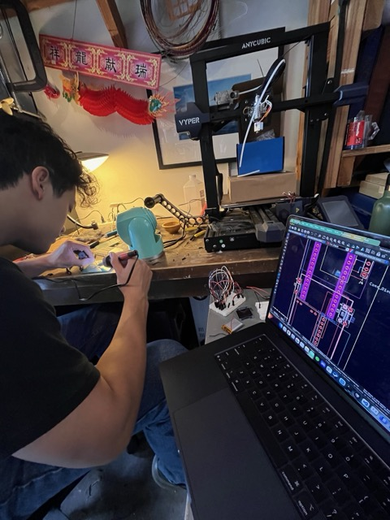
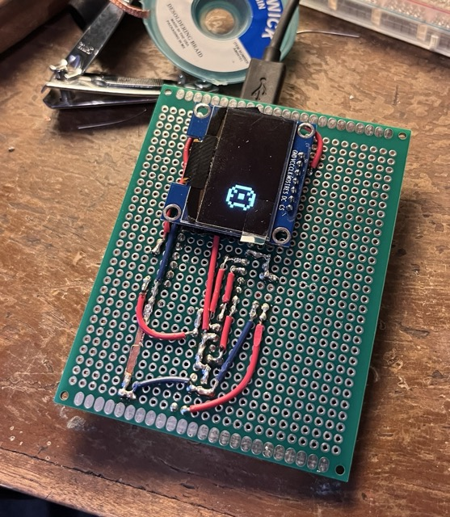
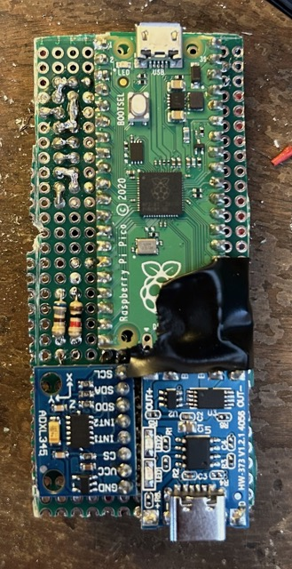
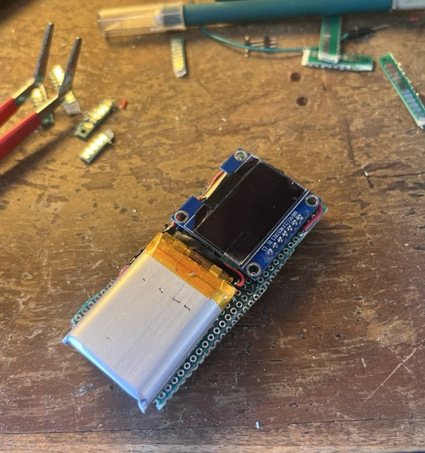

### 4. Designing a Case

Creating a case to house our circuit board was pretty straightforward:
* Measured all the components precisely with a caliper and/or looking at datasheets.
* Modeled the dimensions of the board and electronic components in CAD
* Modeled a box in two parts, the floor and everything else, to fit around the components. This included cutouts for the screen and USB port.
* Added a standoff on both the floor and box for one screw to screw from the floor through the circuit board into the box.
* Added fillets for aesthetics.
* Added tolerances for fit.
* Added a ring at the top so that the device can be used as a keychain

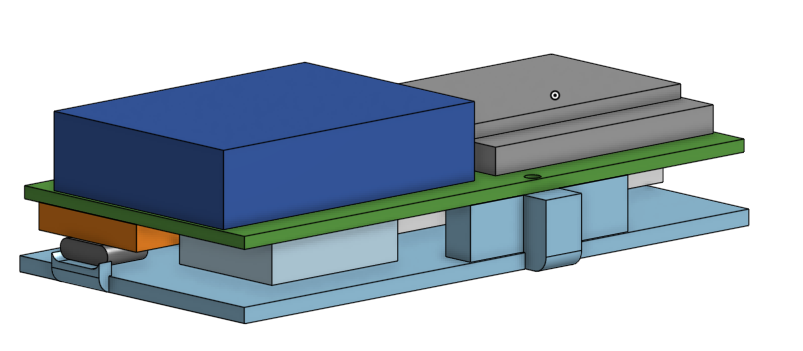
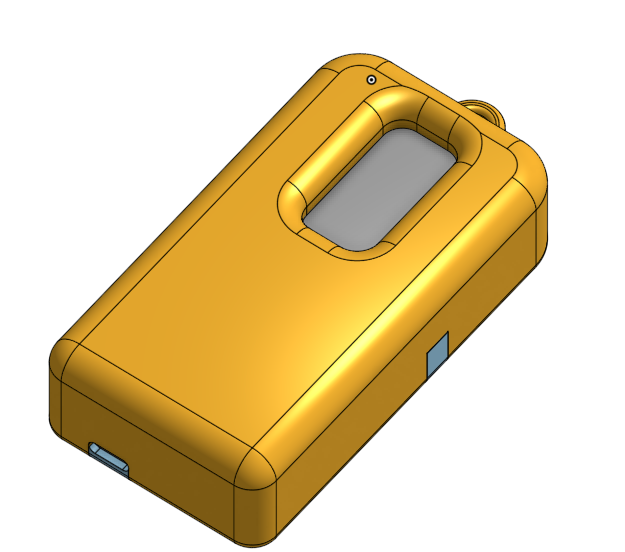
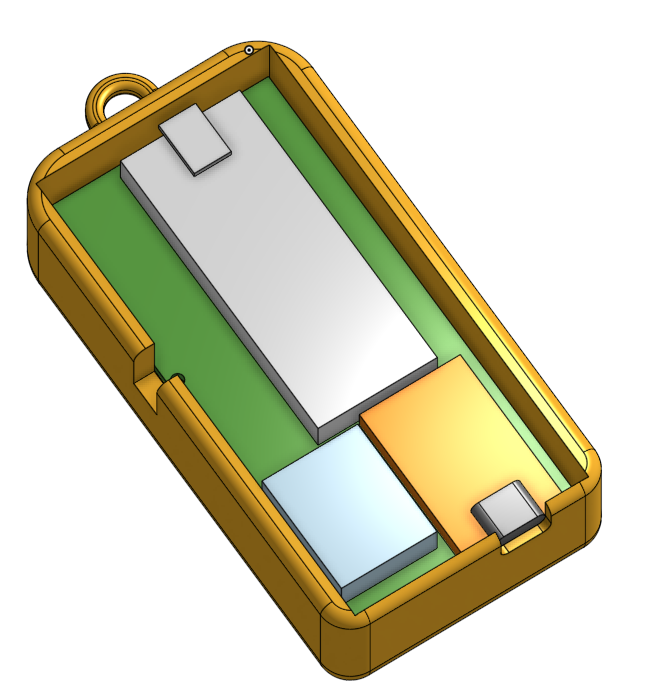
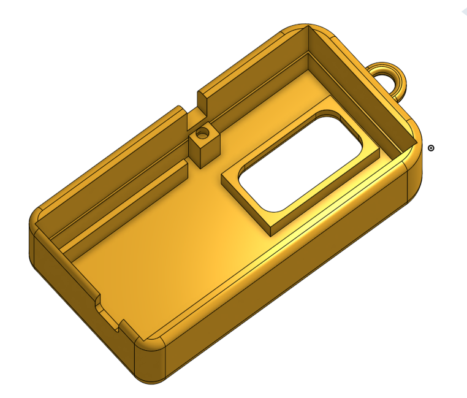
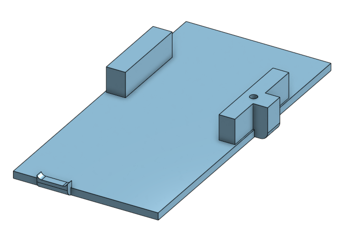

### 5. Interface Design and Art

There are four main features of the user interface that make up what this device is all about: the avatar, the level, the status, and the dialogues.

#### Avatar

The avatar is the defining feature of the device. It is an animation of Milo, our made up character. The drawing style is inspired by 16x16 pixel art Tamagotchi sprites. We drew each frame ourselves using pixel art software, then used a custom Python script, gen_sprites.py, to turn each image into data readable by the Pico, stored in sprites.h. For each status, there is an animation for resting and walking.

#### Level

The level is one of the two “movement-encouraging” features. It is is reflective of your total activity in the history of owning the device: it never goes down, only up. Whenever you move, you gain XP. Once you get a certain amount of XP, you will go up one level. Your level is displayed at the top of the screen. This XP value is hidden, however, a bar below the level indicator will fill up to reflect your progress towards the next level. Each level takes more and more XP to unlock, according to a formula such that level 10 is achievable in one week and level 100 is achievable in one year.

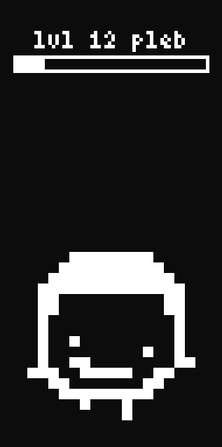

#### Status

The status is the second “movement-encouraging” feature. It is different from level in that it reflects how much you have been moving recently, as opposed to of all time. There are three statuses, “chud”, “pleb”, and “nomad”. The status indicator next to the level indicator will display one of these statuses depending on how much time in the past 72 hours you have spent moving. The current pace for each status are as follows:

Chud: <40 mins / day 
Pleb: ~1hr / day 
Nomad: >3hr / day

The threshold for promoting to a higher status is different than the threshold for demoting down to a lower rank so that sitting on the border between two statuses doesn’t cause weird issues. 

In addition to displaying your status at the top of the screen, Milo will also look different based on status:

| | Chud | Pleb | Nomad |
| :---: | :---:  | :---:  | :---:   |
| **Rest** | 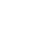|  |  |
| **Walk** | |  | 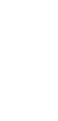 |

#### Dialogues

The dialogues are a feature intended to add a little more whimsy, mystery, and sometimes encouragement to the device. After a long enough period of inactivity, picking up the device will cause text to pop up on the screen saying something about what Milo is doing or thinking about. These dialogues are stored in card_lines.h. Here are some examples:

*"milo is reading feminist literature"* 
*"milo is workshopping his memoir"* 
*"milo wants to go on a hike"* 
*"milo is getting into lifting to get over his boredom"*

Mostly these will just be jokes, however, they are intended to also subtly hint the user towards ways they can find more fulfillment in their own life. 

---

Made with ❤️ by Nigel Weiss and Brenden Cech
